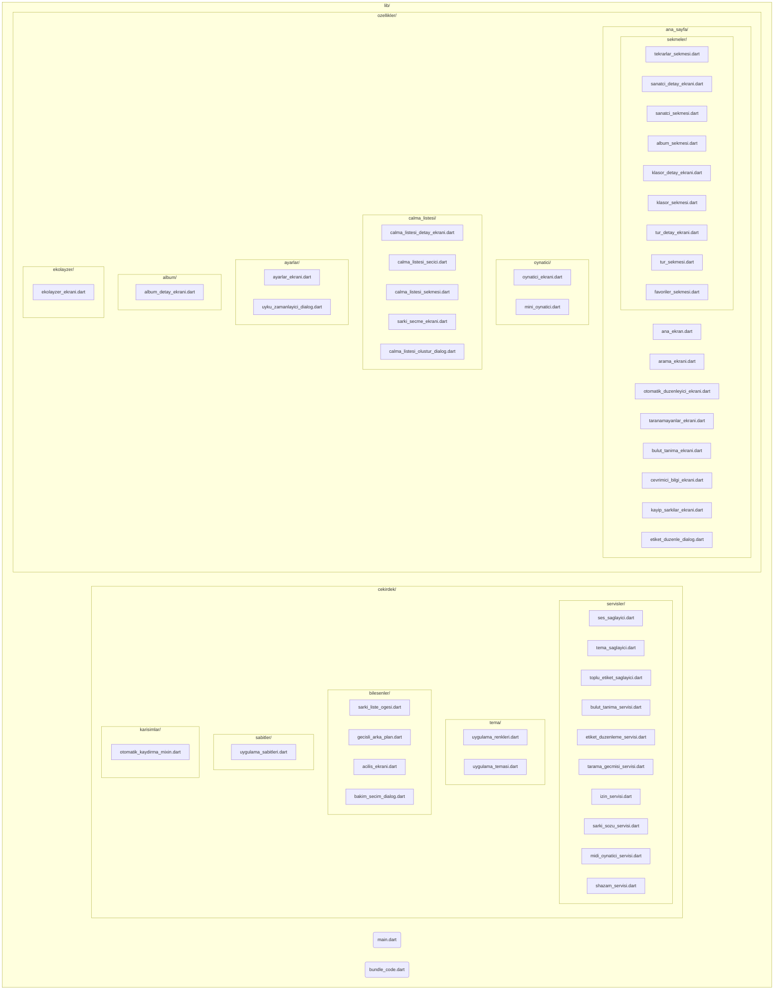

# Proje Yapısı ve İsimlendirme Rehberi (Tam Türkçe)

Klasör isimleri dahil olmak üzere projenin son hali:

```mermaid
graph TD
    subgraph lib["lib/"]
        main("main.dart")
        bundle("bundle_code.dart")
        
        subgraph core["cekirdek/"]
            subgraph services["servisler/"]
                ses["ses_saglayici.dart"]
                tema["tema_saglayici.dart"]
                toplu["toplu_etiket_saglayici.dart"]
                bulut["bulut_tanima_servisi.dart"]
                etiket["etiket_duzenleme_servisi.dart"]
                gecmis["tarama_gecmisi_servisi.dart"]
                izin["izin_servisi.dart"]
                sarki["sarki_sozu_servisi.dart"]
                midi["midi_oynatici_servisi.dart"]
                shazam["shazam_servisi.dart"]
            end
            
            subgraph theme["tema/"]
                renkler["uygulama_renkleri.dart"]
                tema_dosyasi["uygulama_temasi.dart"]
            end
            
            subgraph widgets["bilesenler/"]
                tile["sarki_liste_ogesi.dart"]
                gradient["gecisli_arka_plan.dart"]
                splash["acilis_ekrani.dart"]
                bakim["bakim_secim_dialog.dart"]
            end
            
            subgraph constants["sabitler/"]
                sabitler["uygulama_sabitleri.dart"]
            end
            
             subgraph mixins["karisimlar/"]
                oto_k["otomatik_kaydirma_mixin.dart"]
            end
        end

        subgraph features["ozellikler/"]
            subgraph home["ana_sayfa/"]
                ana["ana_ekran.dart"]
                arama["arama_ekrani.dart"]
                oto["otomatik_duzenleyici_ekrani.dart"]
                tara["taranamayanlar_ekrani.dart"]
                bulut_ekran["bulut_tanima_ekrani.dart"]
                online["cevrimici_bilgi_ekrani.dart"]
                lost["kayip_sarkilar_ekrani.dart"]
                etiket_dialog["etiket_duzenle_dialog.dart"]
                
                subgraph tabs["sekmeler/"]
                    tekrarlar["tekrarlar_sekmesi.dart"]
                    sanatci_d["sanatci_detay_ekrani.dart"]
                    sanatci["sanatci_sekmesi.dart"]
                    album_s["album_sekmesi.dart"]
                    klasor_d["klasor_detay_ekrani.dart"]
                    klasor_s["klasor_sekmesi.dart"]
                    tur_d["tur_detay_ekrani.dart"]
                    tur_s["tur_sekmesi.dart"]
                    favoriler["favoriler_sekmesi.dart"]
                end
            end
            
            subgraph player["oynatici/"]
                p_screen["oynatici_ekrani.dart"]
                mini["mini_oynatici.dart"]
            end
            
            subgraph playlist["calma_listesi/"]
                p_det["calma_listesi_detay_ekrani.dart"]
                p_pick["calma_listesi_secici.dart"]
                p_tab["calma_listesi_sekmesi.dart"]
                sarki_sec["sarki_secme_ekrani.dart"]
                create_pl["calma_listesi_olustur_dialog.dart"]
            end
            
            subgraph settings["ayarlar/"]
                set_scr["ayarlar_ekrani.dart"]
                sleep["uyku_zamanlayici_dialog.dart"]
            end
            
            subgraph album["album/"]
                alb_det["album_detay_ekrani.dart"]
            end
            
             subgraph equalizer["ekolayzer/"]
                eko["ekolayzer_ekrani.dart"]
            end
        end
    end
```

Bu yapı, projenin tamamen Türkçe olduğunu garanti eder.

